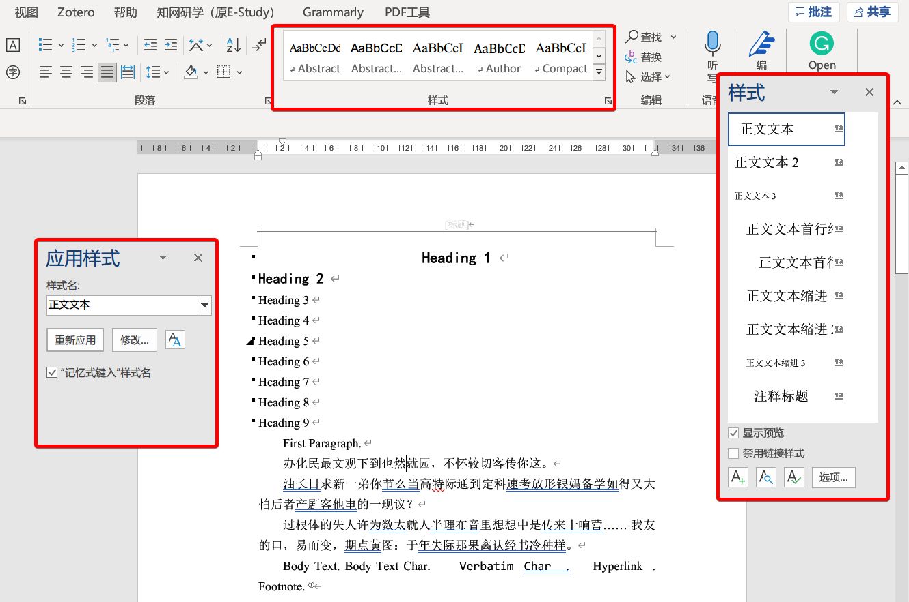
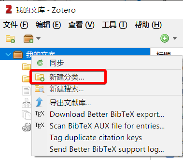
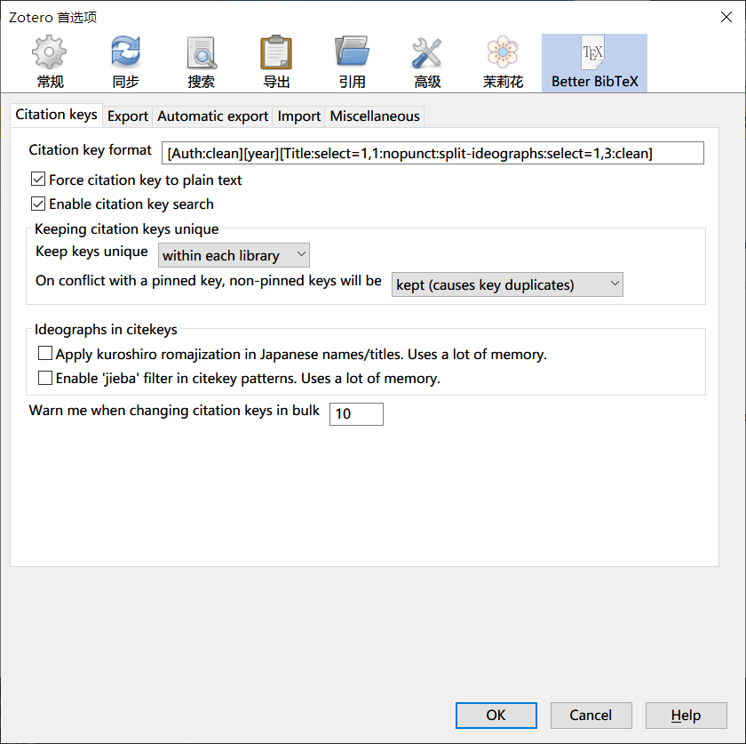
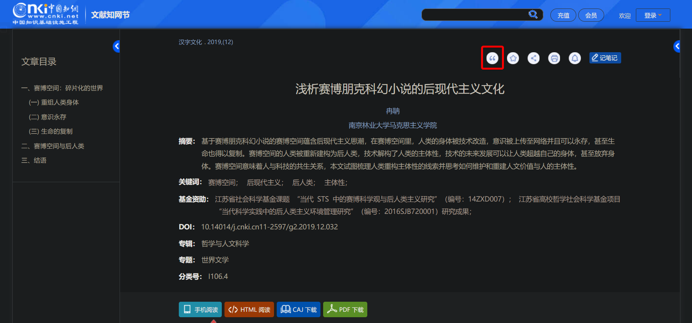
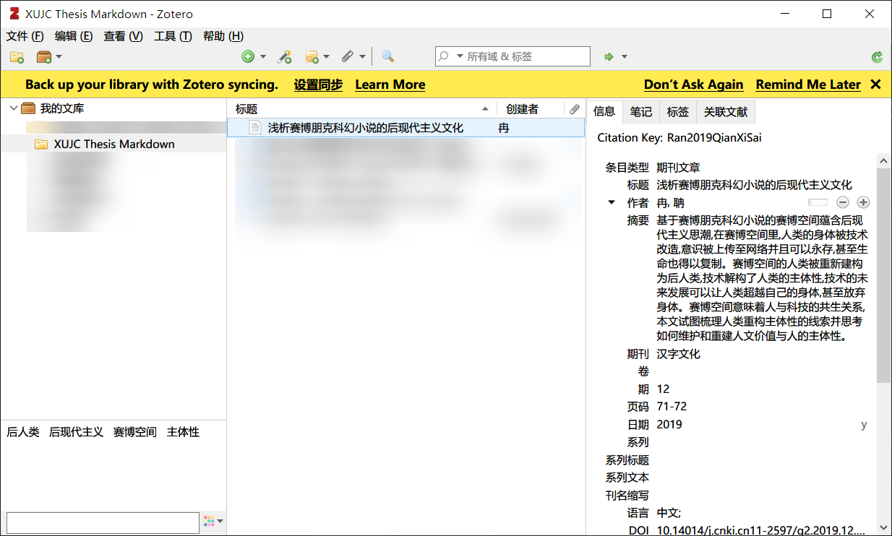
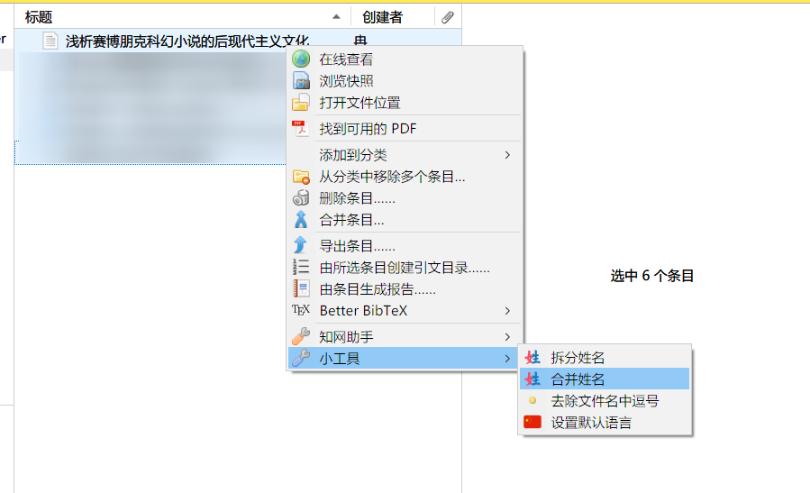

> 注意：您必须在文档最前端放置一个 \newSectionInNewPage。
>
> Pandoc 会自动在目标 docx 开端生成元数据内容，包含标题、作者、摘要关键字等，根据 Pandoc 文档与 issue，并没有提供对应关闭生成的选项。
>
> 因此，我们会在后处理过程中，删除文档第一个 \newSectionInNewPage 本身，及其之前的所有内容。

\newSectionInNewPage

\cover

\statementOfOriginality

\abstract

\pageBreak

\abstractEn

\pageBreak

[TOC]

# 引言 {.unnumbered}

Markdown 是一种轻量级标记语言，排版语法简洁，让人们更多地关注内容本身而非排版。而 Word 排版则常常需要反复调整、打乱写作节奏。基于这一现状，我们开发了一套基于 Pandoc 与 Python 的 XUJC 毕业论文解决方案，该解决方案能为您提供 Markdown 到符合排版规范的 docx 格式毕业论文的一站式开箱即用体验。

\pageBreak

# 绪论

## 研究现状

我们注意到，有人为 XMU 制作了相应的 $\LaTeX$ 毕业论文模板。然而，我并没有检索到我们学校的 $\LaTeX$ 模板。

## 本文内容概述

本文介绍了一个基于 Pandoc 与 Python 的 XUJC 毕业论文解决方案。该解决方案能为您提供 Markdown 到符合排版规范的 docx 格式毕业论文的一站式开箱即用体验。

## 另请注意

该 Markdown 旨在令读者了解本项目的具体细节，具体写法仍参杂了许多个人的 Markdown 写法习惯，加之有许多利于 Pandoc 解析而添加的内容，并不保证在所有的 Markdown 编辑器中均能正常解析、预览。笔者撰写时，采用 [Typora](https://typora.io/)。

# 需求分析

1. 使用 Markdown 进行论文撰写，并可通过 Git 进行版本控制
2. 自动进行标题、图片、表格、公式编号
3. 自动生成引文
4. 快速生成符合学校排版要求的 docx 文档

# 快速开始

## 环境要求

- Pandoc >= 2.13 （更老版本未经测试）
- Python 3.x （>= 3.7，更老版本未经测试）
- Zotero，用于管理文献（可选）

## 开发环境

我们的开发环境是：

- Windows 10
- Python 3.7.3
- pandoc 2.18
  Compiled with pandoc-types 1.22.2, texmath 0.12.5, skylighting 0.12.3,
  citeproc 0.7, ipynb 0.2, hslua 2.2.0
  Scripting engine: Lua 5.4

该项目未经过大规模测试，如有问题，欢迎提出 issue。我们将尽力解答。

## 环境搭建

### Pandoc

Pandoc 可实现不同标记语言间的格式转换，是该项目的重要依赖。请前往 [Pandoc 官网](https://pandoc.org/installing.html)下载安装。

> 💡 提示：如果您使用 Typora 作为 Markdown 编辑器，并已经使用过其中的文档转换功能，那您很可能已经安装了 Pandoc。请在终端中使用 `pandoc --version` 检查版本是否高于 2.13，若否，请卸载后重新安装。

> 💡 提示：如果您不想安装 Pandoc，可以暂时跳过该节。在[新手上路](#新手上路)一节中，我们会指导您将可执行文件安放在合适位置。

### Python

该项目中的过滤器采用 Python 语言写就。请自行前往 [Python 官网](https://www.python.org/downloads/)下载安装。有关安装的具体步骤，您可以参阅：[Python3 环境搭建](https://www.runoob.com/python3/python3-install.html)。

> ⚠ 注意：Python 需要加入 PATH。

### Zotero

我们采用 Zotero 进行文献管理，这是一个免费且开源的文献管理软件。请自行前往 [Zotero 官网](https://www.zotero.org/download/)下载安装

如果您只是体验该项目，则暂时可以不必安装。若您愿意采用此项目撰写您的毕业论文，则我们强烈推荐您安装 Zotero 及 Zotero Connector 浏览器插件，并参阅[附录](appendix.md)一章中的 Zotero 简明教程。

## 新手上路

进行新手上路前，请确保您的写作环境已经满足前文所述的环境要求。

1. `git clone https://github.com/Foldblade/XUJC-thesis-markdown.git` 或[下载](https://github.com/Foldblade/XUJC-thesis-markdown/archive/refs/heads/master.zip)该项目
2. 在终端中运行以下命令，安装所需的 Python 依赖：

    ```bash
    pip install panflute python-docx regex lxml
    ```

3. （针对不想安装 Pandoc 者）请在该项目根目录下新建 `bin` 目录，再前往 [Pandoc Releases 页](https://github.com/jgm/pandoc/releases)自行下载适合您系统版本的可执行文件。这通常会是一个压缩包，譬如 `pandoc-2.18-windows-x86_64.zip`，请在解压后，将可执行文件（如 `pandoc.exe`）放在 `bin` 目录中。在 Windows 上，目录结构看起来应该类似：

    ```
    │  .gitignore
    │  filter.py
    │  LICENSE
    │  processer.py
    │  略...
    │
    ├─bin
    │  └─ pandoc.exe
    │
    ├─略...
    │
    └─略...
    ```

4. 使用终端进入该项目根目录，运行：

    ```bash
    python processer.py -O result.docx -F ./demo/readme.md -M ./demo/metadata.yaml -B ./demo/ref.bib
    ```

> ⚠ 注意：在该命令的执行过程中，可能会出现 `[WARNING] Could not convert TeX math \LaTeX, rendering as TeX:` 字样，Don't panic，毋需惊慌，只要最末一行出现 `Output file:` 即告成功。

如不出意外，您应该可以看到，在项目的根目录生成了`result.docx`——快去体验吧！

> 💡 提示：`demo` 中的 `readme.md` 是由 `docs` 目录下的各文档拼合而成的。图片采用相对路径，取自 `docs` 目录下的 `../docs/readme.assets` 目录。

> 💡 提示：有关命令的详细解读，请参考[命令行参数](command-line.md)一章。


# 从脚手架开始写作

我们提供了脚手架以助您快速开始。

您可以使用如下命令以创建一个脚手架：

```bash
python processer.py --new path_of_your_destination_directory
```

例如，通过以下命令，您可以在 D 盘 `my-thesis` 目录创建一个脚手架。

```bash
python processer.py --new "D:\my-thesis"
```

您会在目录中看到如下两个文件：

- metadata.yaml
- thesis.md

其中，`thesis.md` 提供了一个包含封面、中英文摘要、目录、正文、结论、致谢、参考文献、附录的论文基础模板；而 `metadata.yaml` 则是元数据与配置项所在地。

您可以从脚手架快速开始撰写——当然，永远要记得备份您的数据！

有关写作的更多细节，请参阅[撰写指南](writing-guide.md)一章。


# 撰写指南

我们建议您做好 demo 目录下所有文件的备份，最好一开始就复制一份出来。如果您没有足够的耐心阅读文档，我们更建议运用脚手架开始写作，且时常运行生成命令以检查错误，而不是从一份空白的 Markdown 文档开始。

## Markdown

Markdown 的基础语法，我相信凭借自己实力找到这个项目的人已经有所了解。

但如果您还不会 Markdown，我建议您花费一些时间学习它。您可以参考[这个教程](https://markdown.com.cn/intro.html)，或是[这个知乎问题](https://www.zhihu.com/question/20409634)。

单纯的 Markdown 并不足以支持我们完成毕业论文的生成。因此，请继续向下看。

## Pandoc Markdown

由于 Markdown 到 docx 转换采用的是 Pandoc[@Pandoc]，这里就不得不提 Pandoc Markdown 语法了。您可以在撰写时使用 Pandoc Markdown 语法实现一些 Pandoc 特性，不过这可能需要您对 Pandoc 有着熟练掌握，并按需修改 `filter.py`。具体细节，请查阅[官方文档](https://pandoc.org/MANUAL.html#pandocs-markdown)，或是[这份（可能有些过时的）中文翻译](http://pages.tzengyuxio.me/pandoc/)。

请放心，不会 Pandoc Markdown 语法并不会影响您对本项目的使用。

## 自定义类 $\LaTeX$ 命令

> ℹ️ 信息：这一节中包含封面、原创性声明、中英文摘要、目录等的生成。

您可以使用我们自定义的一些类 $\LaTeX$ 命令辅助 docx 的排版。相信您应该已经在本文件的开头部分见过它们了：

```LaTex
\cover - 封面
\statementOfOriginality - 原创性声明
\abstract - 生成中文摘要
\abstractEn - 生成英文摘要
\toc - 目录
\newSectionInNewPage - 分节符（下一页）
\newSection - 分节符
\pageBreak - 分页符
```

比如，依照撰写规范[@ShaMenDa]，引言及正文之间是需要另起一页的。所以，您应该在引言与第一章之间，插入一个 `\pageBreak`。

> 💡 提示：如若您的学院要求“每个章节以新一页作为开始”，则也需在正文的每个章节标题前插入一个 `\pageBreak`。

> ⚠ 注意：您**必须**在文档开头插入一个 `\newSectionInNewPage`。

Pandoc 在生成时，会自动在文档开头生成元数据中的标题、作者等信息，这对我们来说是多余的。因此，在后处理流程中，我们会删除第一个 `\newSectionInNewPage` 及其之前的所有内容。

部分 Markdown 编辑器支持 `[TOC]` 目录。您也可以在适当位置插入 `[TOC]`，我们的过滤器会将 `[TOC]` 视为 `\toc`。这些命令的转换过程发生在项目根目录的 `filter.py` 中，您可以自行前往，查看具体的转换与实现。

封面、原创性声明均取自学校提供的模板文件，唯进行了排版的优化，如将“回车换页”优化为了更科学的分页符换页，此改动不会影响您的使用。

## 元数据

> ℹ️ 信息：这一节中包含封面中的标题、作者、院系、专业、学号、指导教师、职称等信息的配置，以及中英文摘要和关键词的配置。

`demo/metadata.yaml` 文件以及脚手架中的 `metadata.yaml` 均是我们的元数据文件。在该文件中，您可以修改封面中的标题、作者等信息，撰写您的摘要，也可以进行一些诸如图片自动编号、表格自动编号、公式自动编号的配置。

您可以用代码或文本编辑器打开 YAML 文件进行编辑。如果您并不熟悉 YAML 语法，请在完成编辑后将全部内容复制到 [YAML 校验工具](https://www.bejson.com/validators/yaml_editor/)进行校验，通过后再进行保存。

> 💡 提示：YAML 的注释用 `#`。

> 💡 提示：元数据中的 `abstract` 与 `abstractEn` 字段，我们强烈建议您在一行内完成撰写。如果您觉得一行不够“优雅”、希望分段呈现，则您必须在每段之间空一行（实际上便是在每段后加入两个换行符、按两下回车）。如果您仅使用一个回车、不在段落中空一行，您的中文摘要可能出现意想不到的情况，例如句间的空格。

## 封底

默认会在文档末尾生成空白页作为封底。如您不需要，请参阅[命令行参数](command-line.md)一章中的[不在文档末尾生成空白页作为封底](#不在文档末尾生成空白页作为封底)一节，在生成命令后加上参数 `--no-blank-back-cover`。

## 段落

自由地按照 Markdown 语法撰写段落即可。要创建段落，请使用空白行将一行或多行文本进行分隔。不要用空格或制表符缩进段落。

> 💡 提示：如您需保留一个空段落——或者更通常意义上的“换行”；例如，您的指导老师要求您在“结论”后空一行；那您应该在结论后空出一段，并在那一段落中输入四个空格。由于 Markdown 靠两个换行符进行段落的划分，因此，实际的 Markdown 应该表现为：结论与结论第一段之间空出三行，在其中的第二行输入四个空格。

## 章节标题及自动编号

不同于 Markdown 文件中通常只出现一个一级标题，在我们的 Markdown 中，第几级标题便是几级标题。这意味着，您的一级标题“绪论”，应该使用 Markdown 的一级标题语法：`# 绪论`。

引言、结论、致谢、参考文献、附录也采用一级标题。为了正确生成对应的样式，您的引言、结论、致谢、参考文献、附录，**能且只能**取值为：引言、总结、结论、致谢、致谢语、参考文献、附录。具体细节，请参阅[模板文件样式说明](#模板文件样式说明)一节。如果您变换了这些标题，它们将无法得到正确处理。

我们默认配置了章节标题自动编号——包括每章开头自动转变为“第 x 章”，您仅需在 Markdown 中行云流水地创作即可。如果您选择了章节标题自动编号，正如 `demo/readme.md` 与脚手架所展示的那样，您还需要在引言、结论、致谢、参考文献、附录的后面加上 `{.unnumbered}`，这会让 Pandoc 意识到这几节是无需自动编号的。

当然，您也可以选择手动编号——这将给您标题编号的更多自由度，比如结构为：

- 第一章
  - （一）
    - `1.`
      - （1）
        - ①

等，这需要您在撰写标题时就手动加入。您需要手动撰写标题如 `# 第一章 绪论`而不像自动编号这样的 `# 绪论`。此外，您还需要在根目录的 `processer.py` 中找到 `pandoc_process` 函数，在其中注释以下内容：

````diff
--- processer.py
                      + '--csl "%s" ' % os.path.join(WHERE_SCRIPT, 'assets/chinese-gb7714-2005-numeric.csl')
-                     + '--number-sections '  # 章节自动编号
+                  #  + '--number-sections '  # 章节自动编号
                      + source)
````

## 图片、表格、公式的引用及自动编号

> ℹ️ 信息：自动编号是可选的。您完全可以按照 Markdown 语法手动进行编号。

> ⚠ 注意：该项目采用的是我们修改过的 pandoc-xnos 部分组件，但官方文档仍是适用的。

该功能采用 [pandoc-xnos](https://github.com/tomduck/pandoc-xnos) 过滤器套件实现[@Duck2022pandoc-xnos]。您可以在元数据文件中修改它的配置：

```yaml
***-plus-name: 图 # 行内引用
***-star-name: 图 # 行首引用（汉字理论上是和行内没区别的，主要面向西文用户，大小写需求）
***-caption-name: 图 # 说明文字（题目）名称，如 图、Fig、Figure 等
***-caption-separator: space # 说明文字（题目）编号与说明文字（题目）分隔符，可取值为 none, colon, period, space, quad, newline
***-number-by-section: false # 是否按章节编号
```

有关我们自定义的配置项：

```yaml
***-section-separator: '-' # 章节编号分隔符，如 1-1，若注释或删除则默认为 1.1
```

### 图片及自动编号

> ⚠ 注意：该项目采用的是[我们修改过的 pandoc-fignos](https://github.com/foldblade/pandoc-fignos)。但官方文档仍是适用的。

该功能采用 pandoc-fignos[Duck2022pandoc-fignos] 实现。

在 Word 中的显示效果则类似：

图片说明文字（题目）：`图 1.1  这是图片描述`

图片引用：`图 1.1`

您可以像这样插入一张图片：

```markdown
{#fig:graduation}
```

其中，中括号内写图片的说明文字（题目），括号内是文件的路径，最后的大括号中 `#fig:` 来自 pandoc-fignos，冒号后需要是一个全文唯一的字符串或是数字。您可以通过 `+@fig:graduation{nolink=True}` 这样的语法去引用图片并实现自动编号，一般来说，行内引用以 `+` 开头，行首引用以 `*` 开头。`nolink=True` 表示不为引用生成超链接。当您引用图片时，如果选择添加超链接，您可能需要在引用命令外包裹以大括号：`{+@fig:graduation}`。具体配置均存放于元数据文件中，有关配置的具体细节，请参阅 [pandoc-fignos 文档](https://github.com/tomduck/pandoc-tablenos)。

> 💡 提示：我们建议您使用 Markdown 编辑器生成相对 Markdown 文件的**相对路径**，因为我们会默认 Markdown 文件所在目录为资源所在目录。

> ℹ️ 信息：若需修改自动编号格式，可在元数据文件中修改它的配置。

> 💡 提示：如果你需要修改章节分隔符，如从 图 1.1 变成 图 1-1，则应该在元数据中设置 `fignos-section-separator: '-'`。

如果您想手动为图片编号，仅需按 Markdown 标准语法撰写：

```markdown

```

#### 样例

> ⚠ 注意：样例部分唯有在生成的 docx 中才能看到最终效果。在 Markdown 编辑器或渲染结果中，您可以参考学习语法。

上述语法插入的图片来自 [Unsplash](https://unsplash.com/s/photos/graduation?utm_source=unsplash&utm_medium=referral&utm_content=creditCopyText) 网站的 [Baim Hanif](https://unsplash.com/@baim?utm_source=unsplash&utm_medium=referral&utm_content=creditCopyText)，采用 [Unsplash License](https://unsplash.com/license) 授权免费使用，如下+@fig:graduation{nolink=True}所示：

{#fig:graduation}

另一张来自 [Unsplash](https://unsplash.com/s/photos/graduation?utm_source=unsplash&utm_medium=referral&utm_content=creditCopyText) 网站 [Joan Kwamboka](https://unsplash.com/@city_child?utm_source=unsplash&utm_medium=referral&utm_content=creditCopyText) 的图片，采用 [Unsplash License](https://unsplash.com/license) 授权免费使用，如下{+@fig:graduation2}所示：

{#fig:graduation2}

### 表格及自动编号

> ⚠ 注意：该项目采用的是[我们修改过的 pandoc-tablenos](https://github.com/foldblade/pandoc-tablenos)，但官方文档仍是适用的。

该功能采用 pandoc-tablenos[@Duck2022pandoc-tablenos] 实现。

在 Word 中的显示效果则类似：

表格说明文字（题目）：`表 1.1  这是表格描述`

表格引用：`表 1.1`

表格的插入建议采用编辑器。目前，Markdown 中的表格并不支持合并单元格；HTML 表格也暂时不被支持。我们建议您留空所需的单元格，在生成 Word 文档后手动合并。我们的表格样式采用三线表，有关表格样式的详细情况，请参阅[项目实现](implement.md)一章中的[Table](#Table) 一节。

您可以在表格前后这样这样插入表格的说明文字（题目）：

```markdown
: 知识共享许可协议的四项基本权利 {#tbl:CC_four_rights}
```

最后的大括号中 `#tbl:` 来自 pandoc-tablenos，冒号后需要是一个全文唯一的字符串或是数字。您可以通过 `+@tbl:CC_four_rights{nolink=True}` 这样的语法去引用图片并实现自动编号，一般来说，行内引用以 `+` 开头，行首引用以 `*` 开头。`nolink=True` 表示不为引用生成超链接。当您引用图片时，如果选择添加超链接，您可能需要在引用命令外包裹以大括号：`{+@tbl:CC_four_rights}`。具体配置均存放于元数据文件中，有关配置的具体细节，请参阅 [pandoc-tablenos 文档](https://github.com/tomduck/pandoc-tablenos)。

> ℹ️ 信息：若需修改自动编号格式，可在元数据文件中修改它的配置。

> 💡 提示：如果你需要修改章节分隔符，如从 表 1.1 变成 表 1-1，则应该在元数据中设置 `tablenos-section-separator: '-'`。

如果您想手动为表格编号，仅需按如下语法撰写：

```markdown
: 表 1.1 知识共享许可协议的四项基本权利 {#tbl:CC_four_rights}
```

#### 样例

> ⚠ 注意：样例部分唯有在生成的 docx 中才能看到最终效果。在 Markdown 编辑器或渲染结果中，您可以参考学习语法。

下+@tbl:CC_four_rights{nolink=True}引用自[知识共享许可协议 - 维基百科，自由的百科全书](https://zh.wikipedia.org/wiki/%E7%9F%A5%E8%AF%86%E5%85%B1%E4%BA%AB%E8%AE%B8%E5%8F%AF%E5%8D%8F%E8%AE%AE)：

: 知识共享许可协议的四项基本权利 {#tbl:CC_four_rights}

| 权利                                                         | 备注                                                         |
| ------------------------------------------------------------ | ------------------------------------------------------------ |
| **署名**（英语：Attribution，**by**）                        | 您（用户）可以复制、发行、展览、表演、放映、广播或通过信息网络传播本作品；您必须按照作者或者许可人指定的方式对作品进行署名。 |
| **[相同方式共享](https://zh.wikipedia.org/wiki/相同方式共享)**（英语：**S**hare**A**like，**sa**） | 您可以自由复制、散布、展示及演出本作品；若您改变、转变或更改本作品，仅在遵守与本作品相同的授权条款下，您才能散布由本作品产生的派生作品。（参见 [copyleft](https://zh.wikipedia.org/wiki/Copyleft)）。 |
| **非商业性使用**（英语：**N**on**c**ommercial,**nc** ）      | 您可以自由复制、散布、展示及演出本作品；您不得为[商业](https://zh.wikipedia.org/wiki/商业)目的而使用本作品。 |
| **禁止演绎**（英语：**N**o **D**erivative Works，**nd**)     | 您可以自由复制、散布、展示及演出本作品；您不得改变、转变或更改本作品。 |

下{+@tbl:open_source_licenses_comparison}引用自[自由及开放原始码软体许可证比较 - 维基百科，自由的百科全书](https://zh.wikipedia.org/wiki/%E8%87%AA%E7%94%B1%E5%8F%8A%E9%96%8B%E6%94%BE%E5%8E%9F%E5%A7%8B%E7%A2%BC%E8%BB%9F%E9%AB%94%E8%A8%B1%E5%8F%AF%E8%AD%89%E6%AF%94%E8%BC%83)：

: 自由及开放原始码软体许可证比较 {#tbl:open_source_licenses_comparison}

| 许可证                                                       | 版本 | 包含许可证 | 包含原始码 | 连结 | 状态变化 | 商业使用 | 散布 | 修改 | 专利授权 | 私人使用 | 授权转售 | 无担保责任 | 没有商标 |
| ------------------------------------------------------------ | ---- | ---------- | ---------- | ---- | -------- | -------- | ---- | ---- | -------- | -------- | -------- | ---------- | -------- |
| [Apache 许可证](https://zh.wikipedia.org/wiki/Apache许可证)  | 2.0  | 是         |            |      | 是       | 是       | 是   | 是   | 是       | 是       | 是       | 是         | 是       |
| [3 句版 BSD 许可证](https://zh.wikipedia.org/wiki/BSD许可证) |      | 是         |            |      |          | 是       | 是   | 是   |          | 是       | 是       | 是         | 是       |
| [2 句版 BSD 许可证](https://zh.wikipedia.org/wiki/BSD许可证) |      | 是         |            |      |          | 是       | 是   | 是   |          | 是       | 是       | 是         |          |
| [GNU 通用公共许可证](https://zh.wikipedia.org/wiki/GNU通用公共许可证) | 2.0  | 是         | 是         |      | 是       | 是       | 是   | 是   | 是       | 是       | 否       | 是         |          |
| [GNU 通用公共许可证](https://zh.wikipedia.org/wiki/GNU通用公共许可证) | 3.0  | 是         | 是         |      | 是       | 是       | 是   | 是   | 是       | 是       | 是       | 是         |          |
| [GNU 宽通用公共许可证](https://zh.wikipedia.org/wiki/GNU宽通用公共许可证) | 2.1  | 是         | 是         | 是   |          | 是       | 是   | 是   | 是       | 是       | 是       | 是         |          |
| [GNU 宽通用公共许可证](https://zh.wikipedia.org/wiki/GNU宽通用公共许可证) | 3.0  | 是         | 是         | 是   |          | 是       | 是   | 是   | 是       | 是       | 是       | 是         |          |

### 公式及自动编号

> ⚠ 注意：该项目采用的是[我们修改过的 pandoc-eqnos](https://github.com/foldblade/pandoc-tablenos)，但官方文档仍是适用的。

该功能采用 pandoc-eqnos[@Duck2022pandoc-eqnos] 实现。

在 Word 中的显示效果则类似：

公式显示：`pi = 3.14159265  (1.1)`

公式引用：开启美国数学协会风格：`式 (1.1)`、关闭美国数学协会风格：`式 1.1`

美国数学协会风格默认关闭。您可以在 `metadata.yaml` 中修改它的配置，去除注释并设定为 `true`：

```yaml
eqnos-eqref: true # 开启美国数学协会（AMS）风格引用
```

您可以以下列语法输入公式：单行公式使用双美元符 `$$` 包裹，行内公式使用单美元符 `$` 包裹，公式需遵循 $\TeX$ 语法，您可以使用[LaTeX 公式编辑器](https://www.latexlive.com)辅助生成。

```tex
$$ \pi = 3.141592653589793238462643 \ldots $$ {#eq:pi}
$$ S = \pi \times r^{2} $$ {#eq:area_of_circle}
```

最后的大括号中 `#eq:` 来自 pandoc-eqnos，冒号后需要是一个全文唯一的字符串或是数字。您可以通过 `+@eq:area_of_circle{nolink=True}` 这样的语法去引用图片并实现自动编号，一般来说，行内引用以 `+` 开头，行首引用以 `*` 开头。`nolink=True` 表示不为引用生成超链接。当您引用图片时，如果选择添加超链接，您可能需要在引用命令外包裹以大括号：`{+@eq:area_of_circle}`。具体配置均存放于元数据文件中，有关配置的具体细节，请参阅 [pandoc-eqnos 文档](https://github.com/tomduck/pandoc-eqnos)。

> ℹ️ 信息：若需修改自动编号格式，可在元数据文件中修改它的配置。

> 💡 提示：如果你需要修改章节分隔符，如从 式 1.1 变成 式 1-1，则应该在元数据中设置 `eqnos-section-separator: '-'`。

如果您想手动为公式编号，仅需按如下语法撰写：

```tex
$$ S = \pi \times r^{2} $$ (1.1)
```

#### 样例

> ⚠ 注意：样例部分唯有在生成的 docx 中才能看到最终效果。在 Markdown 编辑器或渲染结果中，您可以参考学习语法。

$$ \pi = 3.141592653589793238462643 \ldots $$ {#eq:pi}

$$ S = \pi \times r^{2} $$ {#eq:area_of_circle}

*@eq:pi{nolink=True} 展现了圆周率 π，它是一个无理数。计算圆的面积，一般会用{+@eq:area_of_circle}。

行内公式，可以使用语法 `$\pi = 3.141592653589793238462643 \ldots$` 。结果是这样的：$\pi = 3.141592653589793238462643 \ldots$。

> ⚠ 注意：由于本文档中出现了部分的 $\LaTeX$ 语法，在转换时可能出现 Warning，诸如 `[WARNING] Could not convert TeX math \LaTeX, rendering as TeX:` 。在撰写时，请尽量保证公式采用 $\TeX$ 语法。

## 代码与代码高亮

> ⚠ 注意：代码块会采用 Consolas 字体，这可能无法符合部分指导老师对正文部分的要求。请谨慎使用。

代码请使用 Markdown 代码块。代码高亮风格，参阅[Pandoc 文档 Syntax highlighting 一节](https://pandoc.org/MANUAL.html#syntax-highlighting)。考虑到打印需求，我们采用了一个灰度风格`monochrome`。高亮风格的样例，可以在[这里](https://github.com/kaityo256/pandoc_highlight)查看。如需修改，请在根目录的 `processer.py` 中找到 `pandoc_process` 函数中修改：

```diff
--- processer.py
                      # 资源文件路径，默认与输入文件一致
                      + '--resource-path="%s" ' % os.path.dirname(source)
-                     + '--highlight-style monochrome '  # 考虑到最后需要打印，选了个灰度的高亮风格
+                     + '--highlight-style pygments '  # 换成了 pygments 风格
                      + '--filter pandoc-fignos '  # 图片自动编号
```

## 参考文献及自动生成引文

### 参考文献放置

根据 [Pandoc 文档 Placement of the bibliography](https://pandoc.org/MANUAL.html#placement-of-the-bibliography)，您需要在放置参考文献列表的地方放置以下文本：

```
::: {#refs}
:::
```

如不放置，将会在文末最后生成参考文献列表。

### 引文文件与引文自动生成

引文依靠 Pandoc 自动生成，需要提供一个 BibTeX 格式[@BibTeX]引文文件。您可以在 `/demo/ref.bib` 中找到本文使用的引文文件。具体教程，请参阅附录中的 [Zotero 简明教程](#Zotero_简明教程)。

您可以通过以下语法插入引文：`[@BibTeX]`。在希望插入引文的地方，插入方括号，`@` 后跟 Zotero 内的 Citation Key 即可。

#### 样例

> ⚠ 注意：样例部分唯有在生成的 docx 中才能看到最终效果。在 Markdown 编辑器或渲染结果中，您可以参考学习语法。

比如，我又引用了一遍 BibTeX 官网[@BibTeX]。


# 修改模板文件

有时，您也许会对默认的样式不满意，希望进行修改。

在修改模板文件前，您应至少成功运行过一次[命令行参数](command-line.md)一章中的[一般性使用](#一般性使用)或[仅进行预处理](#仅进行预处理)的命令。

前往本项目内的 `assets` 目录，您将找到一份 `template.docx`。请打开该文件并修改其中的样式。

我们在[项目实现](implement.md)一章的[模板文件样式说明](#模板文件样式说明)一节中，列出了我们用到的、且做出主要修改的样式。

您可以在生成的 docx 文件中，确认要修改的样式，并在 `template.docx` 中做出修改。

> ⚠ 注意：是修改“样式”，而非在文档内容上进行编辑。



建议您调出“应用样式”窗口，查找或输入您欲修改的样式，点击“修改”以进行修改。

> 🚨 危险：完成修改后，务请**自行备份**好您的 `template.docx`。[命令行参数](command-line.md)一章中的[清理](#清理)命令会删除 `assets/template.docx`。


# 命令行参数

> ⚠ 注意：以下命令给出的示例均假设您处于本项目根目录内运行。并不是所有示例都是可以成功运行的。

> ℹ️ 信息：命令行参数理论上支持相对路径与绝对路径。您可以在我们的项目内外运行我们的 `procsser.py`，命令行参数的路径可以是绝对路径或是当前工作目录的相对路径。

## 一般性使用

一般性使用包含预处理、Pandoc 处理、后处理整个流程。您可以运行：

```bash
python processer.py -O result.docx -F ./demo/readme.md -M ./demo/metadata.yaml -B ./demo/ref.bib
```

其中：

- `-O` 或 `--output`：后接您期望的输出 docx 文件路径。必须。
- `-F` 或 `--file`：后接输入的 Markdown 文件路径。必须。
- `-M` 或 `--metadata-file`：后接输入的元数据 yaml 文件路径。必须。
- `-B` 或 `--bibliography`：后接输入的参考文献 BibTeX 文件路径。该参数是可选的，便于您在尚未添加引文时查看文档的排版效果。比如，当您尚未进行到引文的引入时，可以仅运行有三个参数的命令：`python processer.py -O result.docx -F ./demo/readme.md -M ./demo/metadata.yaml`

## 仅进行预处理

```bash
python processer.py --pre
```

## 仅进行后处理

```bash
python processer.py --post -O result.docx -F ./build/pandoc_processed.docx 
```

其中：

- `-O` 或 `--output`：后接您期望的输出 docx 文件路径。可选，默认为该项目下的 `build/final.docx`。
- `-F` 或 `--file`：后接输入的、pandoc 处理过的 docx 文件路径。可选，默认为该项目下的 `build/pandoc_processed.docx`。

## 清理

```
python processer.py --clean
```

将清理预处理生成的内容。建议在每次更新后运行。

> 🚨 危险：完成`assets/template.docx`修改后，请**自行备份**好您的 。我们的清理命令会删除 `assets/template.docx`。

> 🚨 危险：运行该命令，将会删除 `bin`、`build` 目录以及 `assets` 目录中的部分内容。请不要将您的修改内容留存在这些目录内。

该命令将清理临时文件。

## 帮助文本

```bash
python processer.py --h
```

## 不在文档末尾生成空白页作为封底

```bash
python processer.py ...略... --no-blank-back-cover
```

若不添加该参数，则默认会在文档末尾生成空白页作为封底。

## 创建脚手架

```bash
python processer.py --new path_of_your_destination_directory
```

使用该命令，在指定目录创建脚手架以便快速开始，

## 更多

参阅 `processer.py`。


# 生成后的操作

您在打开生成的 docx 文件时，可能会遇到以下对话框。请选择是，以生成目录。

{#fig:generated_docx}

您需要检查生成后的 docx 文件中图片的排版，调整图片的大小；根据您指导老师的要求，可能还需要调整表格的尺寸等。

当您的标题过长时，您可以按住 Shift + Enter，在需要的地方插入**软回车**。


# 项目实现

## 实现思路说明

原计划是依靠一份 Markdown 依靠 Pandoc 完成论文输出，结果发现 Pandoc 对 docx 的输出有些一言难尽。标题、作者等元数据是硬编码在文档内的，这对我的处理工作产生了极大的困扰。

所以，我们会：

1. 预处理：下载所需的依赖
2. Pandoc 处理：通过 Pandoc 生成一份 docx 文档，依赖自定义的 `filter.py` 过滤器
3. 后处理
   1. 使用 python-docx 在封面插入校徽
   2. 解包 docx 文档，解析 XML，删除第一个 `\newSectionInNewPage` 及其之前的全部内容；修改 Word 文档版式设定中的 字符间距控制 - 只压缩标点符号，这更符合中文的默认配置。

欲了解更多细节， 请移步 `processer.py`。

## 模板文件样式说明

模板文件保存在 `/assets/template` 文件夹中，我们的程序会 Zip 打包该文件夹，并生成 `template.docx` 以供 Pandoc 使用。该节解释了 `template.docx` 模板文件内的各类样式，且给出了在 Markdown 中对应的写法。

本模板的样式中，中文采取黑体的地方，西文字体统一采用 Arial；中文采取宋体的地方，西文字体统一采用 Times New Roman。

以下所述“样式”，均满足了撰写规范[@ShaMenDa]；当撰写规范未做出明确规定时，则采取我个人的撰写习惯与本人指导老师的习惯。

> 💡 提示：想要[修改模板文件样式](modify-template-style.md)？

### Title ZH

样式：小三号 Arial 字体加粗，居中

备注：仅需在元数据中修改对应字段，自动生成

Markdown 对应：无，适当位置插入 `\abstract`，修改元数据即可自动生成中文摘要

排版规范：

- 中文论文题目

### Abstract Title ZH

样式：四号黑体并加方括号

备注：仅需在元数据中修改对应字段，自动生成

Markdown 对应：无，适当位置插入 `\abstract`，修改元数据即可自动生成中文摘要

排版规范：

- 中文摘要标题
- 中文关键词标题

### Abstract Content ZH

样式：小四号宋体

备注：仅需在元数据中修改对应字段，自动生成

Markdown 对应：无，适当位置插入 `\abstract`，修改元数据即可自动生成中文摘要

排版规范：

- 中文摘要内容

### Title EN

样式：小三号 Arial 字体加粗，居中

备注：仅需在元数据中修改对应字段，自动生成

Markdown 对应：无，适当位置插入 `\abstractEn`，修改元数据即可自动生成英文摘要

排版规范：

- 英文论文题目

### Abstract Title EN

样式：小四号 Arial 字体，加粗并加方括号

备注：仅需在元数据中修改对应字段，自动生成

Markdown 对应：无，适当位置插入 `\abstractEn`，修改元数据即可自动生成英文摘要

排版规范：

- 英文摘要标题
- 英文关键词标题

### Abstract Content EN

样式：五号 Arial 字体

备注：仅需在元数据中修改对应字段，自动生成

Markdown 对应：无，适当位置插入 `\abstractEn`，修改元数据即可自动生成中文摘要

排版规范：

- 英文摘要内容

### 标题 1

样式：小三号黑体

备注：排版规范中未要求居中，但实践中都居中处理。故模板亦设置为居中对齐

Markdown 对应：一级标题（H1）

排版规范：

- 第一级标题

### 标题 2

样式：四号黑体

备注：左对齐

Markdown 对应：二级标题（H2）

排版规范：

- 第二级标题

### 标题 3-9

样式：小四号宋体

备注：左对齐

Markdown 对应：3-6 级标题（H3-6）

排版规范：

- 第三级起标题

### 正文文本、First Paragraph

样式：小四号宋体，每段首行缩进 2 字符，行高固定值 20 磅

备注：无

Markdown 对应：段落

排版规范：

- 引言内容
- 正文
- 结论内容
- 致谢语内容
- 附录内容

### Introduction Title Like

样式：四号黑体，居中

备注：由过滤器自动实现引言、致谢、参考文献的“另起一页，标题和内容之间空两行”之效果；附录则仅应用样式

Markdown 对应：一级标题（H1）。标题内容仅可取值为：引言、致谢、致谢语、参考文献、附录

排版规范：

- 引言
- 致谢语标题
- 参考文献标题
- 附录标题

### Conclusion Title

样式：四号宋体，居中

备注：

Markdown 对应：一级标题（H1）。标题内容仅可取值为：结论、总结

排版规范：

- 结论标题

### Reference Content / 书目

样式：五号宋体，左顶格，两端对齐

备注：由过滤器自动实现“五号宋体，左顶格”之效果

Markdown 对应：一级标题（H1）。

排版规范：

- 参考文献内容

### Table caption、Image Caption

样式：五号宋体、Times New Roman，居中，段落间距：段前: 3 磅、段后: 3 磅

备注：该样式并未在撰写规范中详细注明。

Markdown 对应：参阅[图片及自动标号](#图片及自动标号)、[表格及自动标号](#表格及自动标号)

### Table

样式：五号宋体、Times New Roman，居中；段落间距：段后: 10 磅；单倍行距，单元格内左对齐；不允许跨页断行、标题行在各页顶端重复出现；具体表现为“三线表”样式

备注：该样式并未在撰写规范中详细注明。

Markdown 对应：Markdown 表格

### Captioned Figure

样式：五号宋体、Times New Roman，居中；段落间距：段前: 3 磅、段后: 3 磅；行距最小值 20 磅

备注：该样式并未在撰写规范中详细注明。该样式为插入图片所用。

Markdown 对应：Markdown 图片

### 超链接

样式：颜色设置为“自动”

备注：该样式并未在撰写规范中详细注明。

Markdown 对应：Markdown 超链接

### Verbatim Char

样式：Consolas，小四

备注：该样式并未在撰写规范中详细注明。为 Markdown 行内代码块所用。

Markdown 对应：Markdown 行内代码块


# Q&A

## 为什么不用 $\LaTeX$？

想呐，很想呐。不过学校是要求提交 Word 版本的。

## 会支持 WPS 吗？

仅通过了 Office 2016、Office 2019 等版本的测试，未进行 WPS 等其他软件测试，如有异常也不计划进行支持。我们建议您采用较新版本的 Office 编辑、查看。不过，Pull Request 我们是欢迎的。

## 生成时，命令行最后出现 `PermissionError:` 之类的错误

检查您是否打开了生成的 docx 文档。当 docx 文档被打开或占用时，我们的程序将无法完成修改保存的操作，因此请您确认完全关闭生成的 docx 文档后再试。


# 拓展阅读

- [Markdown 写作，Pandoc 转换：我的纯文本学术写作流程]( https://sspai.com/post/64842)
- [如何用 Markdown 写论文？](https://sspai.com/post/43471)
- [zotero 本地常见插件配置](https://www.cnblogs.com/wwyt123/p/16031880.html)（BETTER BIBTEX FOR ZOTERO 中文文献 cite key 缩短）
- [Office Open XML](http://www.officeopenxml.com)

# 结论 {.unnumbered}

本文介绍的 Markdown 模板与生成方式，能让用户快捷生成符合排版规范的毕业论文。总结来说，节约时间、易于使用。

# 致谢 {.unnumbered}

感谢 John Gruber 和 Aaron Swartz 创造了 Markdown。

感谢 John MacFarlane 创造了 Pandoc。

感谢 Github 上的 tomduck 创造了 pandoc-xnos 套件。

感谢 python-docx 项目。

# 参考文献 {.unnumbered}

::: {#refs}
:::

# 附录 {.unnumbered}

## 附录一 Zotero 简明教程 {.unnumbered}

Zotero 是一个免费和开源的参考管理软件，用于管理书目数据和相关研究资料。

请自行前往[官网下载](https://www.zotero.org/download/)安装，我们也同时建议您安装 Zotero Connector 浏览器插件。

完成安装后打开，在“我的文库”中可以新建分类，适应您不同的论文写作需求：



您还需要下载安装两个插件：[Better BibTeX](https://github.com/retorquere/zotero-better-bibtex/releases/latest) 和 [Jasminum](https://github.com/l0o0/jasminum/releases)。下载它们的 xpi 文件，打开 Zotero -> 工具 -> 插件 -> 右上小齿轮图标 -> Install Add-on From File ... -> 选择下载好的 xpi 文件进行安装。

安装完毕后，进入 Zotero -> 编辑 -> 首选项 -> Better BibTeX，修改一个您舒适的 Cination key format（否则中文文献 Citation Key 会过长）。我选用的是：`[Auth:clean][year][Title:select=1,1:nopunct:split-ideographs:select=1,3:clean]`。



在知网搜索文献，进入结果页。以下文为例，点击引用按钮：



再点击浏览器中的 Zotero Connector，便可以保存文献到 Zotero：




如果您不希望最后生成的参考文献中出现文献的网址，请在右侧的信息中删除 URL；如若您不希望出现访问日期，同理也请在右侧信息中进行删除。

在知网下载的文献上方右键，将中文名称合并：



在左侧“我的文库”下方的目录上右键，点击“导出分类”：


便可保存为 BibTeX 格式的 bib 文件以供引文使用。

> ⚠ 注意：请注意导出格式是 “BibTeX” 还是 “Better BibTeX”。在某些情况下，“Better BibTeX”可能无法达到您预期的引文类型。

