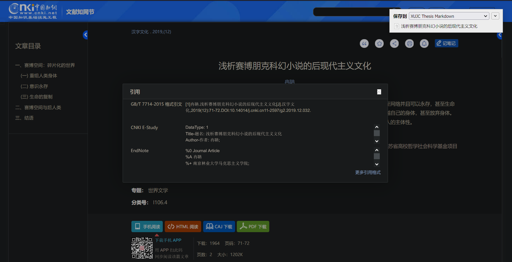
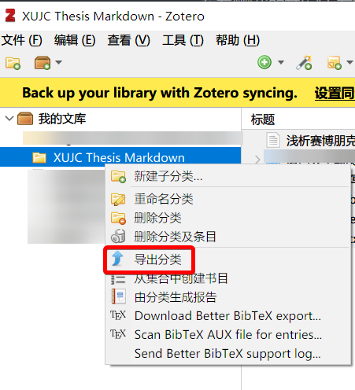

> 注意：您必须在文档最前端放置一个 \newSectionInNewPage。
>
> Pandoc 会自动在目标 docx 开端生成元数据内容，包含标题、作者、摘要关键字等，根据 Pandoc 文档与 issue，并没有提供对应关闭生成的选项。
>
> 因此，我们会在后处理过程中，删除文档第一个 \newSectionInNewPage 本身，及其之前的所有内容。

\newSectionInNewPage

\cover

\statementOfOriginality

\abstract

\pageBreak

\abstractEn

\pageBreak

[TOC]

# 引言 {.unnumbered}

# 绪论

## 研究现状

我们注意到，有人为 XMU 制作了相应的 LaTeX 毕业论文模板。然而，我并没有检索到我们学校的 LaTeX 模板。

## 本文内容概述

本文介绍了一个基于 Pandoc 与 Python 的 XUJC 毕业论文解决方案。该解决方案能为您提供 Markdown 到符合排版规范的 docx 格式毕业论文的一站式开箱即用体验。

## 另请注意

该 Markdown 旨在令读者了解本项目的具体细节，具体写法仍参杂了许多个人的 Markdown 写法习惯，加之有许多利于 Pandoc 解析而添加的内容，并不保证在所有的 Markdown 编辑器中均能正常解析、预览。笔者撰写时，采用 [Typora](https://typora.io/)。

# 需求分析

1. 使用Markdown进行论文撰写，并可通过git进行版本控制
2. 自动进行标题、图片、表格、公式编号
3. 自动生成引文
4. 快速生成符合学校排版要求的docx文档

# 开始使用

## 环境要求

- pandoc（需加入 PATH）
- Python 3.x （>= 3.7）
- Zotero，用于管理文献

## 开发环境

我们的开发环境是：

- Windows 10
- Python 3.7.3
- pandoc 2.13
  - Compiled with pandoc-types 1.22, texmath 0.12.2, skylighting 0.10.5, citeproc 0.3.0.9, ipynb 0.1.0.1

该项目未经过大规模测试，如有问题，欢迎提出 issue。我们将尽力解答。

## 环境搭建

请自行前往 [Pandoc 官网](https://pandoc.org/installing.html)、[Python 官网](https://www.python.org/downloads/)、[Zotero 官网](https://www.zotero.org/download/)下载安装。务请注意，Pandoc 与 Python 应加入 PATH。

## 快速上手

进行快速上手前，请确保您的写作环境已经满足前文所述的环境要求。

1. `git clone` 或下载该项目
2. 在终端中运行以下命令，安装所需的 Python 依赖：

```bash
pip install panflute python-docx regex lxml pandoc-fignos pandoc-eqnos pandoc-tablenos
```

3. 使用终端进入该项目根目录，运行：

```bash
python processer.py -O result.docx -F ./demo/readme.md -M ./demo/metadata.yaml -B ./demo/ref.bib
```

如不出意外，您应该可以看到，在项目的根目录生成了`result.docx`——快去体验吧！

# 如何撰写

Markdown 的基础语法，我相信凭借自己实力找到这个项目的人无需多言。

但如果您还不会 Markdown，我建议您花费一些时间学习它——比起排版浪费的时间，我认为您更应该将时间花费在学习Markdown上。您可以参考[这个教程](https://markdown.com.cn/intro.html)，或是[这个知乎问题](https://www.zhihu.com/question/20409634)。当然，学好 Word 排版也是很有用的，但如果您连排版毕业论文都不会，我还是建议您好好学习一下 Office 操作。

但单纯的 Markdown 并不足以支持我们完成毕业论文的生成。因此，请继续向下看。

## Pandoc Markdown

由于 Markdown 到 docx 转换采用的是 Pandoc[@Pandoc]，这里就不得不提 Pandoc Markdown 语法了。

您可以在撰写时使用 Pandoc Markdown 语法实现一些 Pandoc 特性。具体细节，请查阅[官方文档](https://pandoc.org/MANUAL.html#pandocs-markdown)，或是[这份（可能有些过时的）中文翻译](http://pages.tzengyuxio.me/pandoc/)。

## 自定义类 $\LaTeX$ 命令

您可以使用我们自定义的一些类 $\LaTeX$ 命令辅助 docx 的排版。相信您应该已经在本文件的开头部分见过它们了：

```LaTex
\newSectionInNewPage - 分节符（下一页）
\cover - 封面
\statementOfOriginality - 原创性声明
\pageBreak - 分页符
\abstract - 生成中文摘要
\abstractEn - 生成英文摘要
\toc - 目录
```

部分 Markdown 编辑器支持 [TOC] 目录。您也可以在适当位置插入 [TOC]，我们的过滤器会将 [TOC] 视为 `\toc`。这些命令的转换过程发生在项目根目录的`filter.py`中，您可以自行前往，查看具体的转换与实现。

封面、原创性声明均取自学校提供的模板文件。有关封面内容、页眉内容的自动填写，请参阅下一节[元数据](## 元数据)。

您**必须**在文档开头插入一个 `\newSectionInNewPage`。Pandoc 在生成时，会自动在文档开头生成元数据中的标题、作者等信息，这对我们来说是多余的。因此，在后处理流程中，我们会删除第一个 `\newSectionInNewPage` 及其之前的所有内容。

## 元数据

Pandoc 提供了 YAML 元数据扩展。您可以发现一个 `demo/metadata.yaml` 文件。在该文件中，您可以修改标题、作者等信息，撰写您的摘要，也可以进行一些诸如图片自动编号、表格自动编号、公式自动编号的配置。

您可以用代码或文本编辑器打开 YAML 文件进行编辑。如果您并不熟悉 YAML 语法，请在完成编辑后将全部内容复制到 [YAML 校验工具](https://www.bejson.com/validators/yaml_editor/)进行校验，通过后再进行保存。

## 章节标题及自动编号

为了正确生成对应的样式，您的引言、结论、致谢、参考文献、附录，**能且只能**取值为：引言、总结、结论、致谢、致谢语、参考文献、附录。具体细节，请参阅[模板文件样式说明](## 模板文件样式说明)一节。如果您变换了这些标题，它们将无法得到正确处理。

我们默认配置了章节标题自动编号——包括每章开头自动转变为“第 x 章”，您仅需在 Markdown 中行云流水地创作即可。如果您选择了章节标题自动编号，正如本文件一样，您还需要在引言、结论、致谢、参考文献、附录的后面加上`{.unnumbered}`，这会让 Pandoc 意识到这几节是无需自动编号的。

当然，您也可以选择手动编号。请在根目录的 `processer.py` 中找到 `pandoc_process` 函数中，注释以下内容：

````diff
--- processer.py
                      + '--csl "%s" ' % os.path.join(WHERE_SCRIPT, 'assets/chinese-gb7714-2005-numeric.csl')
-                      + '--number-sections '  # 章节自动编号
+                 #    + '--number-sections '  # 章节自动编号
                      + source)
````

## 图片、表格、公式的引用及自动标号

该功能采用 [pandoc-xnos](https://github.com/tomduck/pandoc-xnos) 过滤器套件实现[@Duck2022pandoc-xnos]。您可以在 `metadata.yaml` 中修改它的配置：

```yaml
***-plus-name: 图 # 行内引用
***-star-name: 图 # 行首引用（汉字理论上是和行内没区别的，主要面向西文用户，大小写需求）
***-caption-name: 图 # 描述文字名称，如 图、Fig、Figure 等
***-caption-separator: period # 描述文字编号与描述文本分隔符
***-number-by-section: false # 是否按章节编号
```

### 图片及自动标号

该功能采用 pandoc-fignos[Duck2022pandoc-fignos] 实现。

在 Word 中的显示效果则类似：

图片说明文字：`图 1. 这是图片描述`

图片引用：`图 1`

您可以像这样插入一张图片：

```markdown
{#fig:graduation}
```

其中，中括号内写图片的说明文字，括号内是文件的路径（建议用编辑器生成相对 markdown 的文件路径），最后的大括号中 `#fig:` 来自 pandoc-fignos，冒号后需要是一个全文唯一的字符串或是数字。您可以通过 `+@fig:graduation{nolink=True}` 这样的语法去引用图片并实现自动标号，一般来说，行内引用以 `+` 开头，行首引用以 `*` 开头。`nolink=True` 表示不为引用生成超链接。当您引用图片时，如果选择添加超链接，您可能需要在引用命令外包裹以大括号：`{+@fig:graduation}`。具体细节，请参阅 [pandoc-fignos 文档](https://github.com/tomduck/pandoc-tablenos)。

上述语法插入的图片来自 [Unsplash](https://unsplash.com/s/photos/graduation?utm_source=unsplash&utm_medium=referral&utm_content=creditCopyText) 网站的 [Baim Hanif](https://unsplash.com/@baim?utm_source=unsplash&utm_medium=referral&utm_content=creditCopyText)，采用 [Unsplash License](https://unsplash.com/license) 授权免费使用，如下+@fig:graduation{nolink=True}所示：

{#fig:graduation}

另一张来自 [Unsplash](https://unsplash.com/s/photos/graduation?utm_source=unsplash&utm_medium=referral&utm_content=creditCopyText) 网站 [Joan Kwamboka](https://unsplash.com/@city_child?utm_source=unsplash&utm_medium=referral&utm_content=creditCopyText) 的图片，采用 [Unsplash License](https://unsplash.com/license) 授权免费使用，如下{+@fig:graduation2}所示：

](readme.assets/joan-kwamboka-hvL7qlvZ5T4-unsplash.jpg){#fig:graduation2}

### 表格及自动编号

该功能采用 pandoc-tablenos[@Duck2022pandoc-tablenos] 实现。

在 Word 中的显示效果则类似：

表格说明文字：`表 1. 这是表格描述`

表格引用：`表 1`

表格的插入建议采用编辑器。您可以在表格前后这样这样插入表格的说明文字：

```markdown
: 知识共享许可协议的四项基本权利 {#tbl:CC_four_rights}
```

最后的大括号中 `#tbl:` 来自 pandoc-tablenos，冒号后需要是一个全文唯一的字符串或是数字。您可以通过 `+@tbl:CC_four_rights{nolink=True}` 这样的语法去引用图片并实现自动标号，一般来说，行内引用以 `+` 开头，行首引用以 `*` 开头。`nolink=True` 表示不为引用生成超链接。当您引用图片时，如果选择添加超链接，您可能需要在引用命令外包裹以大括号：`{+@tbl:CC_four_rights}`。具体细节，请参阅 [pandoc-tablenos 文档](https://github.com/tomduck/pandoc-tablenos)。

下+@tbl:CC_four_rights{nolink=True}引用自[知识共享许可协议 - 维基百科，自由的百科全书](https://zh.wikipedia.org/wiki/%E7%9F%A5%E8%AF%86%E5%85%B1%E4%BA%AB%E8%AE%B8%E5%8F%AF%E5%8D%8F%E8%AE%AE)：

: 知识共享许可协议的四项基本权利 {#tbl:CC_four_rights}

| 权利                                                         | 备注                                                         |
| ------------------------------------------------------------ | ------------------------------------------------------------ |
| **署名**（英语：Attribution，**by**）                        | 您（用户）可以复制、发行、展览、表演、放映、广播或通过信息网络传播本作品；您必须按照作者或者许可人指定的方式对作品进行署名。 |
| **[相同方式共享](https://zh.wikipedia.org/wiki/相同方式共享)**（英语：**S**hare**A**like，**sa**） | 您可以自由复制、散布、展示及演出本作品；若您改变、转变或更改本作品，仅在遵守与本作品相同的授权条款下，您才能散布由本作品产生的派生作品。（参见 [copyleft](https://zh.wikipedia.org/wiki/Copyleft)）。 |
| **非商业性使用**（英语：**N**on**c**ommercial,**nc** ）      | 您可以自由复制、散布、展示及演出本作品；您不得为[商业](https://zh.wikipedia.org/wiki/商业)目的而使用本作品。 |
| **禁止演绎**（英语：**N**o **D**erivative Works，**nd**)     | 您可以自由复制、散布、展示及演出本作品；您不得改变、转变或更改本作品。 |

下{+@tbl:open_source_licenses_comparison}引用自[自由及开放原始码软体许可证比较 - 维基百科，自由的百科全书](https://zh.wikipedia.org/wiki/%E8%87%AA%E7%94%B1%E5%8F%8A%E9%96%8B%E6%94%BE%E5%8E%9F%E5%A7%8B%E7%A2%BC%E8%BB%9F%E9%AB%94%E8%A8%B1%E5%8F%AF%E8%AD%89%E6%AF%94%E8%BC%83)：

: 自由及开放原始码软体许可证比较 {#tbl:open_source_licenses_comparison}

| 许可证                                                       | 版本 | 包含许可证 | 包含原始码 | 连结 | 状态变化 | 商业使用 | 散布 | 修改 | 专利授权 | 私人使用 | 授权转售 | 无担保责任 | 没有商标 |
| ------------------------------------------------------------ | ---- | ---------- | ---------- | ---- | -------- | -------- | ---- | ---- | -------- | -------- | -------- | ---------- | -------- |
| [Apache 许可证](https://zh.wikipedia.org/wiki/Apache许可证)  | 2.0  | 是         |            |      | 是       | 是       | 是   | 是   | 是       | 是       | 是       | 是         | 是       |
| [3 句版 BSD 许可证](https://zh.wikipedia.org/wiki/BSD许可证) |      | 是         |            |      |          | 是       | 是   | 是   |          | 是       | 是       | 是         | 是       |
| [2 句版 BSD 许可证](https://zh.wikipedia.org/wiki/BSD许可证) |      | 是         |            |      |          | 是       | 是   | 是   |          | 是       | 是       | 是         |          |
| [GNU 通用公共许可证](https://zh.wikipedia.org/wiki/GNU通用公共许可证) | 2.0  | 是         | 是         |      | 是       | 是       | 是   | 是   | 是       | 是       | 否       | 是         |          |
| [GNU 通用公共许可证](https://zh.wikipedia.org/wiki/GNU通用公共许可证) | 3.0  | 是         | 是         |      | 是       | 是       | 是   | 是   | 是       | 是       | 是       | 是         |          |
| [GNU 宽通用公共许可证](https://zh.wikipedia.org/wiki/GNU宽通用公共许可证) | 2.1  | 是         | 是         | 是   |          | 是       | 是   | 是   | 是       | 是       | 是       | 是         |          |
| [GNU 宽通用公共许可证](https://zh.wikipedia.org/wiki/GNU宽通用公共许可证) | 3.0  | 是         | 是         | 是   |          | 是       | 是   | 是   | 是       | 是       | 是       | 是         |          |

### 公式及自动编号

该功能采用 pandoc-eqnos[@Duck2022pandoc-eqnos] 实现。

在 Word 中的显示效果则类似：

公式显示：`pi = 3.14159265  (1)`

公式引用：`式 1`

您可以以下列命令输入 $TeX$ 格式公式：

```markdown
$$ \pi = 3.141592653589793238462643 \ldots $$ {#eq:pi}

$$ S = \pi \times r^{2} $$ {#eq:area_of_circle}
```

最后的大括号中 `#eq:` 来自 pandoc-eqnos，冒号后需要是一个全文唯一的字符串或是数字。您可以通过 `+@eq:area_of_circle{nolink=True}` 这样的语法去引用图片并实现自动标号，一般来说，行内引用以 `+` 开头，行首引用以 `*` 开头。`nolink=True` 表示不为引用生成超链接。当您引用图片时，如果选择添加超链接，您可能需要在引用命令外包裹以大括号：`{+@eq:area_of_circle}`。具体细节，请参阅 [pandoc-eqnos 文档](https://github.com/tomduck/pandoc-eqnos)。

$$ \pi = 3.141592653589793238462643 \ldots $$ {#eq:pi}

$$ S = \pi \times r^{2} $$ {#eq:area_of_circle}

*@eq:pi{nolink=True} 展现了 Pi，它是一个无理数。计算圆的面积，一般会用{+@eq:area_of_circle}。

行内公式，可以使用语法 `$\pi = 3.141592653589793238462643 \ldots$` 。结果是这样的：$\pi = 3.141592653589793238462643 \ldots$。

请注意⚠：由于本文档中出现了部分的 $\LaTeX$ 语法，在转换时可能出现 Warning。在撰写时，请尽量保证公式采用 $\TeX$ 语法。

另请注意⚠：根据笔者在 2022 年 3 月 31 日的测试，pandoc_eqnos 存在 bug，会导致生成的 docx 文件无法打开。开发者 nOkuda 提出了问题并提交了 [Pull Requests](https://github.com/tomduck/pandoc-eqnos/pull/64)。目前，我们会下载 [pandoc_eqnos.py](https://raw.githubusercontent.com/nOkuda/pandoc-eqnos/docxOpen/pandoc_eqnos.py) 文件，并将 pandoc_eqnos.py 放置在本文件的同一层级目录下，并使用该文件作为 pandoc_qunos 的过滤器。请关注上述 Pull Requests 是否被合并、pandoc_eqnos 是否更新高于 2.5.0 的版本。若是、且想使用官方版本，请按下修改 `processer.py`：

```diff
--- processer.py
                      + '--filter pandoc-fignos '  # 图片自动编号
                      + '--filter pandoc-tablenos '  # 表格自动编号
-                     # '--filter pandoc_eqnos '  # 公式自动编号，
+                     '--filter pandoc_eqnos '  # 公式自动编号，

                      # 2022年 3 月 31 日，个人测试 pandoc_eqnos 存在 bug，会导致生成的 docx 文件无法打开
                      # 开发者 nOkuda 提出了问题并提交了 PR，参见：https://github.com/tomduck/pandoc-eqnos/pull/64
                      # 我们会下载 https://raw.githubusercontent.com/nOkuda/pandoc-eqnos/docxOpen/pandoc_eqnos.py
                      # 并将 pandoc_eqnos.py 放置在本文件的同一层级目录下，并使用该文件作为 pandoc_qunos 的过滤器。
                      # 请关注 https://github.com/tomduck/pandoc-eqnos/pull/64 是否被合并、
                      # pandoc_eqnos 是否更新高于 2.5.0 的版本。若是、且想使用官方版本，
                      # 请：注释下一行，并取消上方“公式自动编号”行的注释。
-                     '--filter pandoc_eqnos.py '  # 公式自动编号，
+                     # '--filter pandoc_eqnos.py '  # 公式自动编号，

                      # 上面三个自动编号过滤器必须前置于我们的自定义过滤器与 --citeproc
```

## 代码与代码高亮

代码请使用 Markdown 代码块。代码高亮风格，参阅[Pandoc 文档 Syntax highlighting 一节](https://pandoc.org/MANUAL.html#syntax-highlighting)。考虑到打印需求，我们采用了一个灰度风格`monochrome`。高亮风格的样例，可以在[这里](https://github.com/kaityo256/pandoc_highlight)查看。如需修改，请在根目录的 `processer.py` 中找到 `pandoc_process` 函数中修改：

```diff
--- processer.py
                      # 资源文件路径，默认与输入文件一致
                      + '--resource-path="%s" ' % os.path.dirname(source)
-                     + '--highlight-style monochrome '  # 考虑到最后需要打印，选了个灰度的高亮风格
+                     + '--highlight-style pygments '  # 换成了 pygments 风格
                      + '--filter pandoc-fignos '  # 图片自动编号
```

## 参考文献及自动生成引文

### 参考文献放置

根据 [Pandoc 文档 Placement of the bibliography](https://pandoc.org/MANUAL.html#placement-of-the-bibliography)，您需要在放置参考文献列表的地方放置以下文本：

```
::: {#refs}
:::
```

如不放置，将会在文末最后生成参考文献列表。

### 引文文件与引文自动生成

引文依靠 Pandoc 自动生成，需要提供一个 BibTeX 格式[@BibTeX]引文文件。您可以在 `/demo/ref.bib` 中找到本文使用的引文文件。具体教程，请参阅附录中的 [Zotero 简明教程](## Zotero_简明教程)。

您可以通过以下语法插入引文：`[@BibTeX]`。在希望插入引文的地方，插入方括号，`@` 后跟 Zotero 内的 Citation Key 即可。比如，我又引用了一遍 BibTeX 官网[@BibTeX]。

# 文件转换与目标生成

以下命令**均假设您处于本项目目录内使用**。

## 一般性使用

一般性使用包含预处理、Pandoc 处理、后处理整个流程。您可以运行：

```bash
python processer.py -O result.docx -F ./demo/readme.md -M ./demo/metadata.yaml -B ./demo/ref.bib
```

其中：

- `-O` 或 `--output`：后接您期望的输出 docx 文件路径。必须。
- `-F` 或 `--file`：后接输入的 Markdown 文件路径。必须。
- `-M` 或 `--metadata-file`：后接输入的元数据 yaml 文件路径。必须。
- `-B` 或 `--bibliography`：后接输入的参考文献 BibTeX 文件路径。该参数是可选的，便于您在尚未添加引文时查看文档的排版效果。

## 仅进行预处理

```bash
python processer.py --pre
```

## 仅进行后处理

```bash
python processer.py --post -O result.docx -F ./build/pandoc_processed.docx 
```

其中：

- `-O` 或 `--output`：后接您期望的输出 docx 文件路径。可选，默认为该项目下的 `build/final.docx`。
- `-F` 或 `--file`：后接输入的、pandoc 处理过的 docx 文件路径。可选，默认为该项目下的 `build/pandoc_processed.docx`。

## 清理

```
python processer.py --clean
```

该命令将清理临时文件。

## 帮助文本

```bash
python processer.py --h
```

## 更多

参阅 `processer.py`。

时间紧迫，参数未经过详细测试。使用非上方指明参数写法，一切后果由您自负。

# 生成后的操作

您在打开生成的 docx 文件时，可能会遇到以下对话框。请选择是，以生成目录。

{#fig:generated_docx}

您需要检查生成后的 docx 文件中图片的排版，调整图片的大小。

当您的标题过长时，您可以按住 Shift + Enter，在需要的地方插入**软回车**。

# 项目实现

## 实现思路说明

原计划是依靠一份 Markdown 依靠 Pandoc 完成论文输出，结果发现 Pandoc 对 docx 的输出有些一言难尽。标题、作者等元数据是硬编码在文档内的，这对我的处理工作产生了极大的困扰。

所以，我们会：

1. 预处理：下载所需的依赖
2. Pandoc 处理：通过 Pandoc 生成一份 docx 文档，依赖自定义的 `filter.py` 过滤器
3. 后处理
    1. 使用 python-docx 在封面插入校徽
    2. 解包 docx 文档，解析 XML，删除第一个 `\newSectionInNewPage` 及其之前的全部内容；修改 Word 文档版式设定中的 字符间距控制 - 只压缩标点符号，这更符合中文的默认配置。

欲了解更多细节， 请移步 `processer.py`。

## 模板文件样式说明

模板文件保存在 `/assets/template` 文件夹中，我们的程序会 Zip 打包该文件夹，并生成 `template.docx` 以供 Pandoc 使用。该节解释了 `template.docx` 模板文件内的各类样式，且给出了在 Markdown 中对应的写法。

本模板的样式中，中文采取黑体的地方，西文字体统一采用 Arial；中文采取宋体的地方，西文字体统一采用 Times New Roman。

以下所述“样式”，均参考自排版规范[@ShaMenDa]。

### 三号黑体，居中（一行写不下可分为两行，题目与摘要之间空一行）

- 中文论文题目

### Title ZH

样式：小三号 Arial 字体加粗，居中

备注：仅需在元数据中修改对应字段，自动生成

Markdown 对应：无，适当位置插入 `\abstract`，修改元数据即可自动生成中文摘要

排版规范：

- 中文论文题目

### Abstract Title ZH

样式：四号黑体并加方括号

备注：仅需在元数据中修改对应字段，自动生成

Markdown 对应：无，适当位置插入 `\abstract`，修改元数据即可自动生成中文摘要

排版规范：

- 中文摘要标题
- 中文关键词标题

### Abstract Content ZH

样式：小四号宋体

备注：仅需在元数据中修改对应字段，自动生成

Markdown 对应：无，适当位置插入 `\abstract`，修改元数据即可自动生成中文摘要

排版规范：

- 中文摘要内容

### Title EN

样式：小三号 Arial 字体加粗，居中

备注：仅需在元数据中修改对应字段，自动生成

Markdown 对应：无，适当位置插入 `\abstractEn`，修改元数据即可自动生成英文摘要

排版规范：

- 英文论文题目

### Abstract Title EN

样式：小四号 Arial 字体，加粗并加方括号

备注：仅需在元数据中修改对应字段，自动生成

Markdown 对应：无，适当位置插入 `\abstractEn`，修改元数据即可自动生成英文摘要

排版规范：

- 英文摘要标题
- 英文关键词标题

### Abstract Content EN

样式：五号 Arial 字体

备注：仅需在元数据中修改对应字段，自动生成

Markdown 对应：无，适当位置插入 `\abstractEn`，修改元数据即可自动生成中文摘要

排版规范：

- 英文摘要内容

### 标题 1

样式：小三号黑体

备注：排版规范中未要求居中，但实践中都居中处理。故模板亦设置为居中对齐

Markdown 对应：一级标题（H1）

排版规范：

- 第一级标题

### 标题 2

样式：四号黑体

备注：左对齐

Markdown 对应：二级标题（H2）

排版规范：

- 第二级标题

### 标题 3-9

样式：小四号宋体

备注：左对齐

Markdown 对应：3-6 级标题（H3-6）

排版规范：

- 第三级起标题

### 正文文本、First Paragraph

样式：小四号宋体，每段首行缩进 2 字符

备注：模板中该样式的“段落-行距”按个人习惯设定为 1.2 倍行高。撰写规范中的**建议**值为 20 ~~磅，而小四号字体的高度为 12 磅，1.6 倍后的行高为 19.2 磅，感知不强。~~Word 中的行高似乎依赖网格，具体特性尚在研究，但确实是感知不强。

Markdown 对应：段落

排版规范：

- 引言内容
- 正文
- 结论内容
- 致谢语内容
- 附录内容

### Introduction Title Like

样式：四号黑体，居中

备注：由过滤器自动实现引言、致谢、参考文献的“另起一页，标题和内容之间空两行”之效果；附录则仅应用样式

Markdown 对应：一级标题（H1）。标题内容仅可取值为：引言、致谢、致谢语、参考文献、附录

排版规范：

- 引言
- 致谢语标题
- 参考文献标题
- 附录标题

### Conclusion Title

样式：四号宋体，居中

备注：

Markdown 对应：一级标题（H1）。标题内容仅可取值为：结论、总结

排版规范：

- 结论标题

### Reference Content

样式：五号宋体，左顶格

备注：由过滤器自动实现“五号宋体，左顶格”之效果

Markdown 对应：一级标题（H1）。标题内容仅可取值为：参考文献

排版规范：

- 参考文献内容

# 扩展阅读

- [Markdown 写作，Pandoc 转换：我的纯文本学术写作流程]( https://sspai.com/post/64842)
- [如何用 Markdown 写论文？](https://sspai.com/post/43471)
- [zotero 本地常见插件配置](https://www.cnblogs.com/wwyt123/p/16031880.html)（BETTER BIBTEX FOR ZOTERO 中文文献 cite key 缩短）

# 结论 {.unnumbered}

本文介绍的 Markdown 模板与生成方式，能让用户快捷生成符合排版规范的毕业论文。总结来说，节约时间、易于使用。

# 致谢 {.unnumbered}

感谢 John Gruber 和 Aaron Swartz 创造了 Markdown。

感谢 John MacFarlane 创造了 Pandoc。

感谢 Github 上的 tomduck 创造了 pandoc-xnos 套件。

感谢 python-docx 项目。

# 参考文献 {.unnumbered}

::: {#refs}
:::

# 附录 {.unnumbered}

## 附录一 Zotero 简明教程 {.unnumbered}

Zotero 是一个免费和开源的参考管理软件，用于管理书目数据和相关研究资料。

请自行前往[官网下载](https://www.zotero.org/download/)安装，我们也同时建议您安装 Zotero Connector 浏览器插件。

完成安装后打开，在“我的文库”中可以新建分类，适应您不同的论文写作需求：


您还需要下载安装两个插件：[Better BibTeX](https://github.com/retorquere/zotero-better-bibtex/releases/latest) 和 [Jasminum](https://github.com/l0o0/jasminum/releases)。下载它们的 xpi 文件，打开 Zotero -> 工具 -> 插件 -> 右上小齿轮图标 -> Install Add-on From File ... -> 选择下载好的 xpi 文件进行安装。

安装完毕后，进入 Zotero -> 编辑 -> 首选项 -> Better BibTeX，修改一个您舒适的 Cination key format（否则中文文献 Citation Key 会过长）。我选用的是：`[Auth:clean][year][Title:select=1,1:nopunct:split-ideographs:select=1,3:clean]`。


在知网搜索文献，进入结果页。以下文为例，点击引用按钮：


再点击浏览器中的 Zotero Connector，便可以保存文献到 Zotero：




如果您不希望最后生成的参考文献中出现文献的网址，请在右侧的信息中删除 URL。

在知网下载的文献上方右键，将中文名称合并：


在左侧“我的文库”下方的目录上右键，点击“导出分类”：




便可保存为 BibTeX 格式的 bib 文件以供引文使用。
