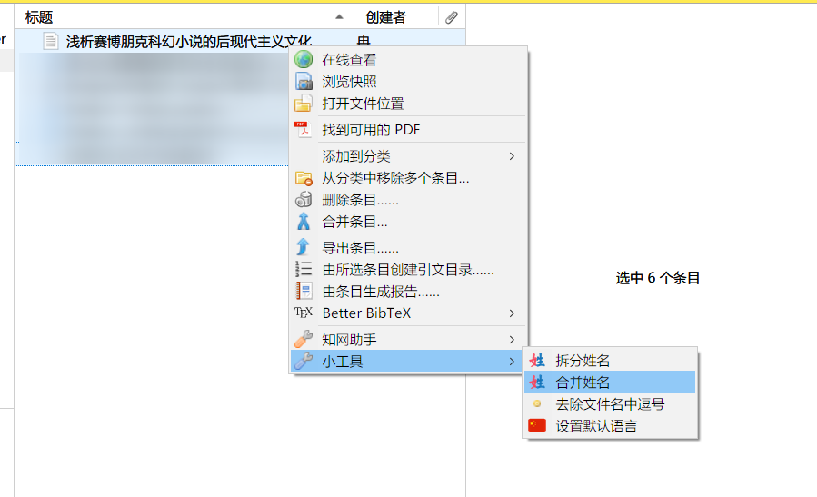

# 附录 {.unnumbered}

## 附录一 Zotero 简明教程 {.unnumbered}

Zotero 是一个免费和开源的参考管理软件，用于管理书目数据和相关研究资料。

请自行前往[官网下载](https://www.zotero.org/download/)安装，我们也同时建议您安装 Zotero Connector 浏览器插件。

完成安装后打开，在“我的文库”中可以新建分类，适应您不同的论文写作需求：

您还需要下载安装两个插件：[Better BibTeX](https://github.com/retorquere/zotero-better-bibtex/releases/latest) 和 [Jasminum](https://github.com/l0o0/jasminum/releases)。下载它们的 xpi 文件，打开 Zotero -> 工具 -> 插件 -> 右上小齿轮图标 -> Install Add-on From File ... -> 选择下载好的 xpi 文件进行安装。

安装完毕后，进入 Zotero -> 编辑 -> 首选项 -> Better BibTeX，修改一个您舒适的 Cination key format（否则中文文献 Citation Key 会过长）。我选用的是：`[Auth:clean][year][Title:select=1,1:nopunct:split-ideographs:select=1,3:clean]`。

在知网搜索文献，进入结果页。以下文为例，点击引用按钮：

再点击浏览器中的 Zotero Connector，便可以保存文献到 Zotero：

!!! tip
    如果您不希望最后生成的参考文献中出现文献的网址或 DOI，请在右侧的信息中删除 URL、DOI 或是相关信息；如若您不希望出现访问日期，同理也请在右侧信息中进行删除。

在知网下载的文献上方右键，将中文名称合并：

在左侧“我的文库”下方的目录上右键，点击“导出分类”：

便可保存为 BibTeX 格式的 bib 文件以供引文使用。

!!! warning
    请注意导出格式是 “BibTeX” 还是 “Better BibTeX”。在某些情况下，“Better BibTeX”可能无法达到您预期的引文类型。
