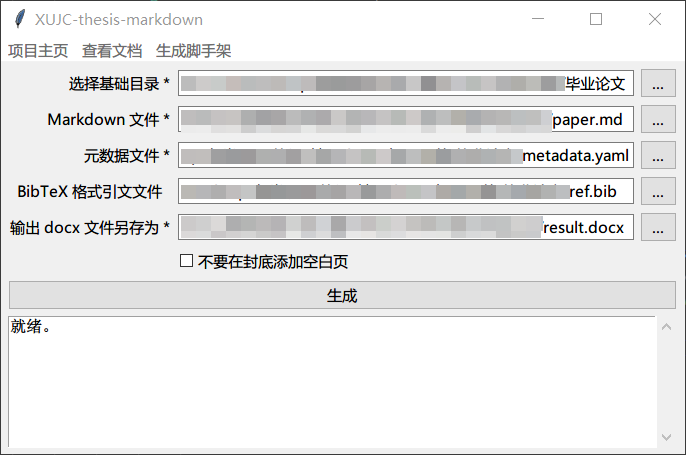

# 图形用户界面（GUI）

我们提供了简单的 GUI 以助您使用。要使用 GUI，请在项目根目录中执行：

```
python gui.py
```

稍后您将看到如图所示的 GUI。



点击菜单栏中的“生成脚手架”，您可以选择一个空目录生成一个脚手架，并在其中开始写作。

您可以在“选择基础目录”一栏中，点击右侧 `...` 按钮，选择您上一步指定的脚手架目录。我们的程序将会自动识别其中的 Markdown 文件、元数据文件与 BibTeX 格式引文文件这“[三大元素](three-elements.md)”。请在完成自动识别后**进行检查**，如果自动识别出的文件并不是您需要使用的文件，请点击右侧 `...` 按钮，重新选择您需要使用的文件。

勾选“不要在封底添加空白页”，则不会在封底添加空白页。

您还需要在“输出 docx 文件另存为”一栏中，点击右侧 `...` 按钮，指定输出文件的存放位置。

点击“生成”按钮，便会在指定的输出文件存放位置生成输出文件。成功或是失败都会有弹窗提示，错误信息将会在窗体下方显示。
